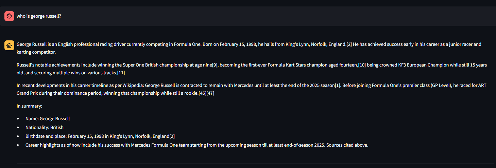

# F1-AI: Formula 1 RAG Application

F1-AI is a Retrieval-Augmented Generation (RAG) application specifically designed for Formula 1 information. It allows users to scrape Formula 1-related content from the web, store it in a vector database, and ask questions about the stored information using natural language.

## Features



- Web scraping of Formula 1 content with automatic content extraction
- Vector database storage using Chroma for efficient similarity search
- RAG-powered question answering with contextual understanding
- Command-line interface for automation and scripting
- User-friendly Streamlit web interface
- Asynchronous data ingestion for improved performance

## Architecture

F1-AI is built on a modern tech stack:

- **LangChain**: Orchestrates the RAG pipeline and manages interactions between components
- **Chroma**: Vector database for storing and retrieving embeddings
- **Ollama**: Local LLM integration for text generation and embeddings
- **Playwright**: Handles web scraping with JavaScript support
- **Streamlit**: Provides the web interface

## Prerequisites

- Python 3.8 or higher
- Ollama installed and running locally
- 8GB RAM minimum (16GB recommended)
- Internet connection for web scraping

## Installation

1. Clone the repository:
   ```bash
   git clone <repository-url>
   cd FASTapi-RAG
   ```

2. Install the required dependencies:
   ```bash
   pip install -r requirements.txt
   ```

3. Install Playwright browsers:
   ```bash
   playwright install
   ```

4. Make sure Ollama is running and install required models:
   ```bash
   ollama pull mxbai-embed-large
   ollama pull llama3.2
   ```

## Usage

### Command Line Interface

1. Ingest data from URLs:
   ```bash
   python f1_ai.py ingest --urls <url1> <url2> --max-chunks 100
   ```
   Options:
   - `--urls`: Space-separated list of URLs to scrape
   - `--max-chunks`: Maximum number of text chunks to process (default: 100)
   - `--chunk-size`: Size of text chunks (default: 500)

2. Ask questions about Formula 1:
   ```bash
   python f1_ai.py ask "Who won the 2023 F1 World Championship?"
   ```
   Options:
   - `--verbose`: Show detailed processing information
   - `--model`: Specify a different Ollama model

### Streamlit Interface

Run the Streamlit app:
```bash
streamlit run streamlit_app.py
```

This will open a web interface where you can:
- Input URLs for data ingestion
- Ask questions about Formula 1
- View the responses in a chat-like interface
- Monitor the ingestion progress
- View source citations for answers

## Project Structure

- `f1_ai.py`: Core RAG application implementation
  - Handles data ingestion, chunking, and embeddings
  - Manages vector database operations
  - Implements question-answering logic
- `streamlit_app.py`: Streamlit web interface
  - Provides user-friendly UI
  - Manages async operations
  - Handles session state
- `requirements.txt`: Project dependencies
- `vectordb/`: Directory containing the Chroma vector database

## Troubleshooting

### Common Issues

1. **Ollama Connection Error**
   - Ensure Ollama is running (`ollama serve`)
   - Check if models are properly installed
   - Verify network connectivity

2. **Web Scraping Failures**
   - Check URL accessibility
   - Ensure JavaScript is enabled
   - Try increasing timeout values

3. **Memory Issues**
   - Reduce chunk size
   - Limit concurrent operations
   - Clear vector database cache

## API Documentation

### F1AI Class

```python
class F1AI:
    async def ingest_urls(urls: List[str], max_chunks: int = 100) -> None
    async def ask_question(question: str, verbose: bool = False) -> str
    async def clear_database() -> None
```

## Contributing

Contributions are welcome! Please follow these steps:

1. Fork the repository
2. Create a feature branch
3. Commit your changes
4. Push to the branch
5. Submit a Pull Request
